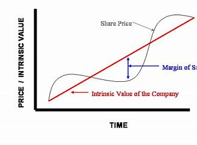

---
# Display name
name: Maxwell Wilson
avatar_image: "image1.jpg"
# Username (this should match the folder name)
authors:
- admin
# resume download button
btn:
- url : "img/cv.pdf"
  label : "Download Resume"

# Is this the primary user of the site?
superuser: true

# Social/academia Networking
# For available icons, see: https://sourcethemes.com/academic/docs/widgets/#icons
#   For an email link, use "fas" icon pack, "envelope" icon, and a link in the
#   form "mailto:your-email@example.com" or "#contact" for contact widget.
social:
- icon: envelope
  icon_pack: fas
  link: '#contact'  # For a direct email link, use "mailto:test@example.org".
#- icon: twitter
#  icon_pack: fab
#  link: https://twitter.com/GeorgeCushen
- icon: linkedin
  icon_pack: fab
  link: http://www.linkedin.com/in/maxwellwilson10/
#- icon: github
#  icon_pack: fab
#  link: https://github.com/gcushen
# Link to a PDF of your resume/CV from the About widget.
# To enable, copy your resume/CV to `static/files/cv.pdf` and uncomment the lines below.  
# - icon: cv
#   icon_pack: ai
#  link: files/cv.pdf

# Enter email to display Gravatar (if Gravatar enabled in Config)
email: ""
  
# Organizational groups that you belong to (for People widget)
#   Set this to `[]` or comment out if you are not using People widget.  
user_groups:
- Researchers
- Visitors
---
**Margin of Safety**

Margin of safety is the difference between the market price and its intrinsic value. In other words the margin of safety is a "cushion" between the objective vs its speculative value. This "cushion" serves as a hedge against various levels of uncertainty.The greater level of uncertainty, the larger the margin of safety is required. cvxv

